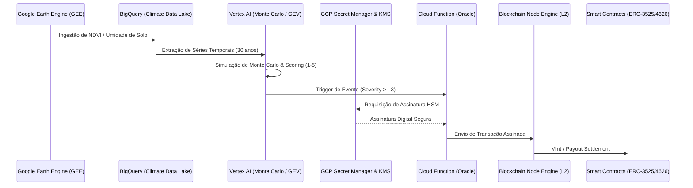

# 🎭 Prompt Maestro: Ecossistema ClimateWise (RWA)

Este documento apresenta o panorama técnico definitivo para o desenvolvimento da plataforma **ClimateWise**, uma infraestrutura de nível institucional para tokenização de índices climáticos (Real World Assets), potencializada pelo Google Cloud.

---

## 🏗️ Fluxograma Geral de Dados: "From Space to Chain"

---

## 📅 Roadmap de Desenvolvimento (5 Fases)

### 🚀 Fase 1: MVP - Inteligência Climática & Pipeline GEE
**Descrição**: Estabelecimento da "Fonte da Verdade" analítica. Integração do processamento geoespacial com o Data Lakehouse do Google.
- **Implementação**:
    - **GEE Integration**: Scripts em JavaScript/Python para processamento de imagens Sentinel-2 (NDVI) localizadas por polígonos de safra.
    - **BigQuery Setup**: Armazenamento de datasets meteorológicos (ERA5/NOAA) via Dataflow.
    - **Vertex AI Core**: Treinamento de modelos Extreme Value Theory (EVT) para calcular probabilidades de cauda.
- **Stack**: Python (Pandas, GEE API, Sklearn), SQL (BigQuery), Terraform.

### 🔐 Fase 2: Segurança - Trust Layer (BNE & KMS)
**Descrição**: Transição da infraestrutura de "Dev" para "Enterprise" através de custódia institucional e baixa latência.
- **Implementação**:
    - **BNE Configuration**: Ativação do Blockchain Node Engine para Polygon, garantindo RPC privado e 0% de throttling.
    - **KMS Signer**: Implementação de um middleware Python que traduz transações Ethereum para o formato de assinatura assimétrica do Cloud KMS.
    - **Oracle Design**: Cloud Function isolada por VPC, acessando o Vertex AI via Service Account com permissões mínimas (Principle of Least Privilege).
- **Stack**: Python (`web3.py`, `google-cloud-kms`), GCP Cloud Functions, VPC Service Controls.

### 📈 Fase 3: Escala - Settlement Layer (ERC-3525)
**Descrição**: Sofisticação do ativo RWA. O ERC-3525 permite que uma apólice seja única (ID/Coordenada) mas tenha saldo fungível (USDC).
- **Implementação**:
    - **Semi-Fungible Contract**: Desenvolvimento do contrato mestre ERC-3525.
    - **Escrow Logic**: O prêmio pago pelo usuário entra em um contrato de colateralização automática.
    - **Settlement Automático**: O Oráculo (Fase 2) chama a função `triggerPayout(tokenId)` que libera o saldo do Escrow baseado no Score de Severidade.
- **Stack**: Solidity (ERC-3525 Standard), Hardhat, OpenZeppelin.

### 💰 Fase 4: Marketplace - Liquidez & ERC-4626
**Descrição**: Criação do ecossistema de liquidez bilateral para investidores (Reinsurance-as-a-Service).
- **Implementação**:
    - **Protocolo ERC-4626**: Implementação de Yield-bearing Vaults. Investidores depositam USDC para colateralizar o risco e recebem prêmios em troca.
    - **Risk Tranching**: Divisão da liquidez em tranches de risco (Sênior/Júnior) no BigQuery para análise de rentabilidade.
    - **Transparency Portal**: Interface que consome o BigQuery para mostrar o `audit_trail` de cada payout.
- **Stack**: Solidity, Next.js, Recharts, BigQuery API.

### 🌍 Fase 5: Ecossistema - Créditos de Carbono & Expansão
**Descrição**: Integração total da resiliência climática com os mercados de carbono.
- **Implementação**:
    - **Carbon Sync**: Validação de preservação (via GEE) gera tokens de crédito que podem servir como colateral no Marketplace (Fase 4).
    - **Global Oracle Network**: Descentralização do oráculo via rede de nós independentes validando o mesmo score GEE.
- **Stack**: Solidity, Chainlink Functions (External Adapters).

---

## 🛡️ Mitigação de Riscos Técnicos

| Risco | Descrição | Estratégia de Mitigação |
| :--- | :--- | :--- |
| **Gás & Escalabilidade** | Custos altos de transação na rede principal. | Implementação em **Polygon PoS** ou **Base L2**; uso de pacotes de dados compactados. |
| **Latência de Imagem** | Delay no processamento do satélite GEE. | Modelo de "Predictive Settlement" onde o oráculo pré-valida a tendência antes da confirmação final. |
| **Oracle Failure** | O oráculo pára de enviar dados ou envia dados errados. | **Multi-Oracle Consensus**: 3 Cloud Functions independentes em diferentes regiões GCP devem concordar no Score. |
| **Custódia** | Vazamento de chaves privadas. | Uso exclusivo de **Cloud KMS HSM**. Nenhuma pessoa física possui acesso à chave; o acesso é via IAM roles de máquinas. |

---
*Documento gerado pelo Maestro ClimateWise. Pronto para execução.*
